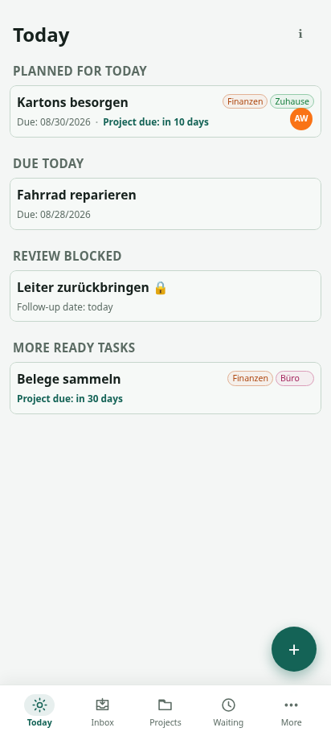
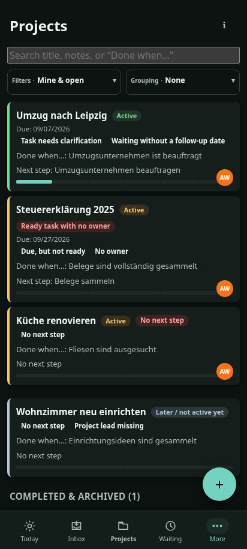

# Machbar

> **Das ist machbar.**

Machbar is a self-hosted household task system for turning shared commitments
into clear next actions. It is designed for families who need more structure
than chat messages or a shared checklist, without adopting the ceremony of a
workplace project-management suite.



Machbar combines ideas from GTD, org-mode, and lightweight Scrum in a workflow
adapted to household life:

- capture requests and ideas before deciding what they mean;
- clarify the next concrete action when there is time to think;
- give a project one visible driver while delegating individual tasks;
- define what “done” means with acceptance criteria;
- keep waiting items, follow-ups, dependencies, and stuck projects visible;
- derive each person’s Today view from dates, state, and responsibility.

The methodology is optional. Machbar presents practical views such as
**Today**, **Inbox**, **Projects**, and **Waiting** rather than asking a
household to run formal GTD reviews or Scrum ceremonies.

## The niche

Machbar is intended for a technically inclined family or household that wants
to operate its own shared system.

It is a better fit when:

- household projects have several steps or unclear ownership;
- work often pauses while waiting for another person, company, or delivery;
- a personal todo list cannot represent shared responsibility well;
- privacy and local control matter more than a hosted service ecosystem;
- most daily interaction happens from a phone.

It is not trying to be a general collaboration platform, a personal notes
app, or a full Scrum tracker.

## Mobile-first and part of the operating system

Machbar is an installable PWA with touch-sized controls and swipe shortcuts.
On supported Android browsers it can receive text and URLs from the system
share sheet, either creating new work or appending the material to an existing
task or project. Tasks and projects can also be shared out through the native
share sheet, with a clipboard fallback where Web Share is unavailable.

The interface is available in German and English. Appearance can follow the
operating system or be fixed to light or dark mode; both preferences are
stored locally in the browser.



Machbar currently requires a connection to its server. Installation as a PWA
does not provide offline task access.

## Self-hosting profile

- React/Vite frontend and Fastify API served by one Node.js process
- SQLite storage in one persistent file
- Single Docker container or standalone npm deployment
- No database server or other required external service
- Optional Pocket ID authentication through OpenID Connect
- Reverse-proxy, sub-path, and Home Assistant Ingress support

## Quick start with Docker Compose

Requirements: Docker with the Compose plugin.

```bash
git clone https://github.com/temporaer/machbar.git
cd machbar
docker compose up --build -d
```

Open `http://localhost:3000`. On an empty installation, create the first
household member in the browser. The SQLite database is stored in the named
`machbar-data` volume.

See [Getting started](docs/getting-started.md) for first-use orientation and
[Deployment](docs/deployment.md) for upgrades, backups, reverse proxies,
configuration, and Pocket ID.

## Current status

Machbar is usable software, but it is still a young, opinionated project:

- clients do not receive live updates from other browsers;
- the app requires network access to the Machbar server;
- recurrence and reminder fields exist, but there is no automatic recurrence
  or notification delivery yet;
- SQLite is intended for one running Machbar instance, which is a good fit for
  a home deployment but not a horizontally scaled service;
- the Home Assistant add-on files are currently development packaging, not a
  published one-click add-on repository.

Read [Status and limitations](docs/status-and-limitations.md) before relying on
Machbar for a particular deployment.

## Documentation

- [Getting started](docs/getting-started.md)
- [Household workflow](docs/workflow.md)
- [Deployment and configuration](docs/deployment.md)
- [Development](docs/development.md)
- [Architecture](docs/architecture.md)
- [Home Assistant](docs/home-assistant.md)
- [Status and limitations](docs/status-and-limitations.md)
