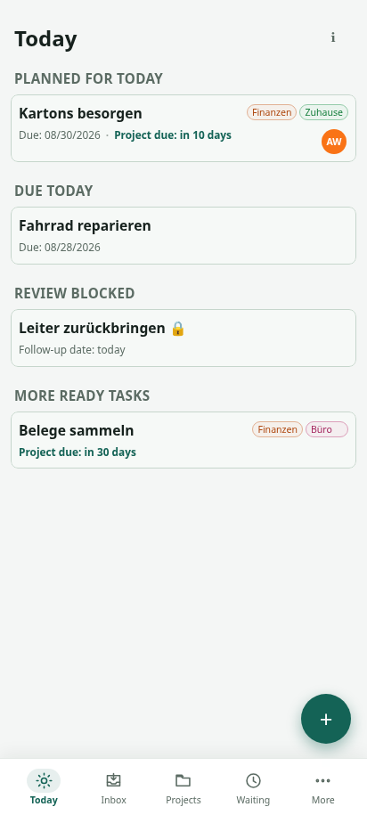
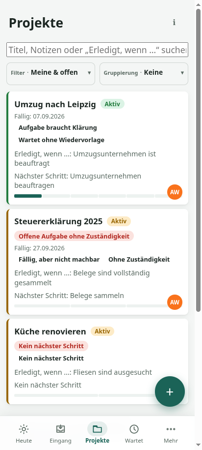

# Machbar

> **Das ist machbar.**

Machbar is a lightweight, multi-user task system for households and other small
groups, built around one central question: **what can actually be done next?**
Tasks and projects can be shared, owned, delegated, or simply visible to
everyone without turning everyday coordination into project management.

It combines frictionless capture with explicit refinement of larger projects, a
focused Today view, waiting and dependency handling, and just enough structure
for context, areas, deadlines, and responsibility. The goal is to turn the messy
stream of household obligations, errands, ideas, and multi-step projects into a
small set of clear next actions—while keeping individual work and shared
responsibilities visible without constant manual grooming.



## More than a shared checklist

A shopping item is easy. Organizing a holiday, repairing a room, handling an
insurance claim, or keeping up with recurring maintenance is not. Real life has
unclear requests, hand-offs, dependencies, deadlines, and things that cannot
continue until somebody else responds.

Machbar does not ask you to keep rearranging one giant list. It understands the
difference between captured work, something actionable, a project with several
steps, and work that is intentionally waiting.

### Capture now, clarify when ready

Get an obligation out of your head before deciding exactly what it means.
Capture always creates a task—never an ambiguous scrap—so it is immediately
real, ownable, and findable. Add metadata or a project destination directly if
you already know them, or leave a plain task in the Inbox for later
refinement. If a captured task turns out to describe an outcome with several
steps, promote it to a project when that becomes clear, instead of having to
decide up front.

For unclear text, photos, and files, **Verarbeiten** offers a separate intake
and clarification path. It uses the paired Home Assistant integration and its
configured `ai_task.*` entity to prepare an editable proposal of Machbar work
and optional calendar events. Nothing is created until a person reviews and
chooses **Übernehmen**. Home Assistant remains authoritative for the AI
provider and calendar; Machbar is not an AI assistant or a calendar system.

### See what is genuinely actionable

Today brings together planned and due work, reached follow-ups, and the next
useful action—or explicitly parallel next actions—from active projects.
Personal and household-wide views keep individual focus without hiding shared
responsibilities.

### Give projects direction

A project connects a desired outcome with the path toward it. Keep possible
projects in the backlog, define what “done” means when that helps, and start
only when there is a real next step or an intentional wait.

### Plan the week without building a calendar

Spread actionable work across the next seven days while keeping planned work,
real deadlines, and waiting follow-ups distinct. Week planning uses the same
eligibility rules as Today, so it stays one more lens on the same work
instead of turning tasks into calendar appointments.

### Treat waiting as part of the work

Tasks can wait on another task, a person, a company, an event, or a delivery.
Add a revisit date and Machbar brings the item back when attention is useful,
instead of leaving it to disappear in a note or clutter Today too early.

### Review decisions, not everything

Inbox owns clarifying new captures, so Review is not a general processing
queue. It surfaces organized work whose structure or state now needs a
decision: a stuck project, a wait with no future follow-up, aging Someday or
backlog work, or a project whose tasks are done but the outcome itself hasn’t
been reviewed. Healthy work stays out of the way, while **All** keeps the
complete inventory searchable whenever you need it.

### Keep useful structure lightweight

Use owners, areas, places, tags, deadlines, dependencies, and completion
criteria where they improve a decision. Recurring tasks can schedule their next
occurrence from actual completion, which works well for maintenance that never
happens on a perfect calendar. Due-dated work can be exported as a one-off ICS
file for an external calendar, without ongoing synchronization.

## Work, not everything around the work

Machbar deliberately does not try to become a family super-app. It is not a
calendar, mail client, document store, shopping or meal planner, messaging
system, parcel tracker, or generic workflow-automation tool.

Those systems often contain information that changes what can be done next.
Machbar integrates with them where useful, while they remain authoritative for
their own state. Machbar owns the resulting work: commitments, responsibility,
sequencing, waiting, follow-up, and the decision about what deserves attention
now.

New structure should earn its place by making that work easier to capture,
understand, execute, or review—not by modelling every real-world process inside
Machbar.

## For people who enjoy systems—but do not want to manage one

Machbar borrows practical ideas from GTD, org-mode, and lightweight agile
planning: capture, next actions, explicit waiting, project outcomes, and regular
reconsideration. It turns those ideas into a few everyday views rather than a
methodology your household has to learn.

It is a good fit when:

- shared lists have become noisy but full project-management software feels
  absurd;
- household projects often have several steps, unclear ownership, or external
  dependencies;
- you want a trusted Today view instead of repeatedly scanning every list;
- most interaction happens from a phone;
- privacy and control of the data matter.



## Built for everyday use

Machbar is mobile-first, installable as a PWA, and available in German and
English with light and dark modes. Supported desktop and mobile browsers can
receive standards-based Web Push notifications on each opted-in device, even
without an open Machbar window. Supported Android browsers can also capture
text, links, images, and files directly from the share sheet.

It is private and self-hosted: one small service and one persistent SQLite
database, with optional Pocket ID authentication. No hosted account or external
database is required. An optional Paperless-ngx integration stores images and
documents referenced from Markdown notes; Paperless owns the files and its API
token remains on the Machbar server. The paired Home Assistant integration can
filter Today by a household member's current place and, when configured with an
attachment-capable AI Task entity and writable calendar, can execute the
Verarbeiten bridge.

## Run it yourself in minutes

Requirements: Docker with the Compose plugin. Verarbeiten additionally
requires the paired Machbar Home Assistant custom integration (protocol 2),
Home Assistant 2025.8 or newer, a configured `ai_task.*` entity that supports
attachments for images and PDFs, and a writable `calendar.*` entity selected in
the integration options flow. `.txt` files are decoded as UTF-8 and included
as delimited source text instead of binary attachments; invalid UTF-8 is
rejected. Machbar stores no AI-provider credentials, Google credentials, or
Home Assistant access token.

```bash
git clone https://github.com/temporaer/machbar.git
cd machbar
docker compose up --build -d
```

Open `http://localhost:3000`, create the first household member, and start
capturing work. Data lives in the persistent `machbar-data` volume.

Machbar is young, opinionated software. Read
[Status and limitations](docs/status-and-limitations.md) before relying on it
for a particular deployment.

## Documentation

- [Getting started](docs/getting-started.md)
- [Household workflow](docs/workflow.md)
- [Deployment and configuration](docs/deployment.md)
- [Development](docs/development.md)
- [Architecture](docs/architecture.md)
- [Home Assistant](docs/home-assistant.md)
- [Status and limitations](docs/status-and-limitations.md)
